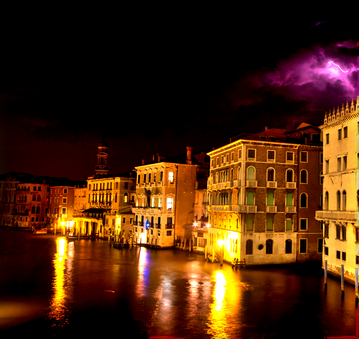
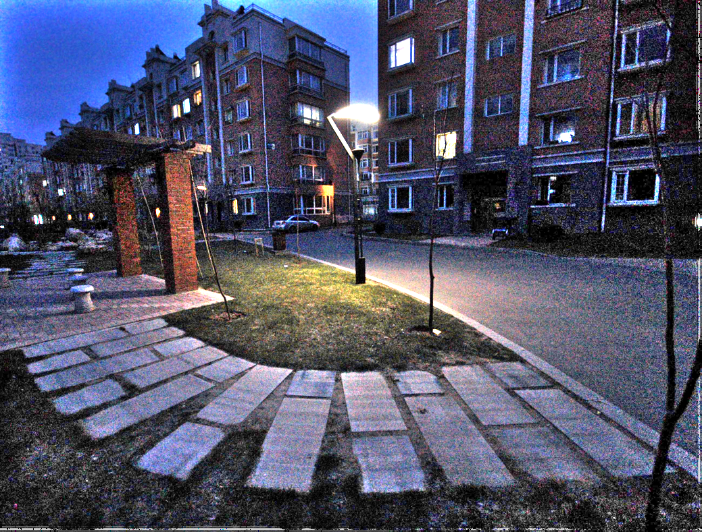

# Low-light Image Enhancement

## Introduce

This is a python version of low-light image enhancement, which is for my graduation thesis.

If you think this is useful and interesting, please give me a **star**!😁

`LIME.py` is main procedure.

`mainwindow.py` and `Ui_mainwindow.py` are used to draw GUI.

## Example

<table>
	<tr>
    		<td></td>
    		<td></td>
	</tr>
	<tr>
		<td></td>
		<td></td>
	</tr>
	<tr>
		<td></td>
		<td></td>
	</tr>
	<tr>
		<td colspan="2"></td>
	</tr>
</table>

## Related Publications

* Guo X, Li Y, Ling H. LIME: Low-Light Image Enhancement via Illumination Map Estimation. *IEEE Transactions on Image Processing* **2017**, *26* (2), 982–993. https://doi.org/10.1109/TIP.2016.2639450.
